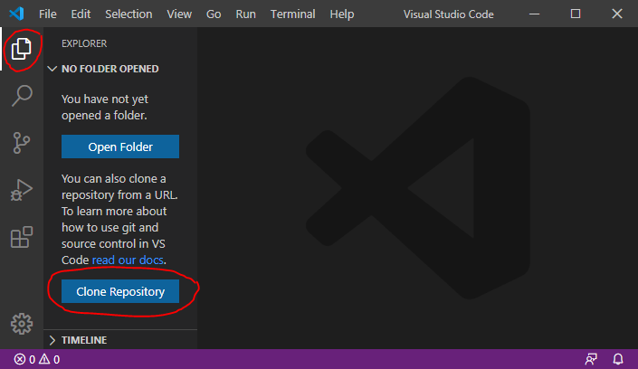
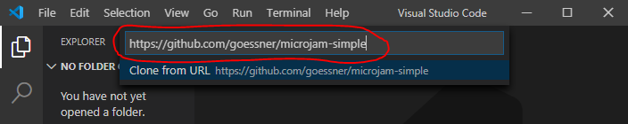
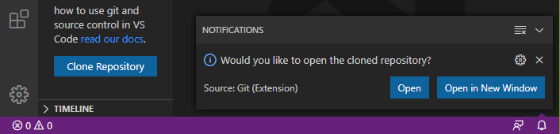
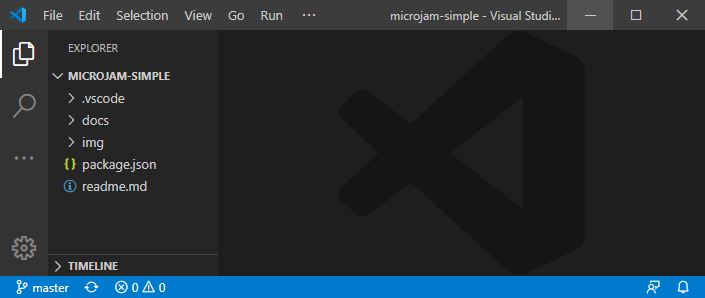

# Clonages de templates

## Pré-requis

Il est supposé que vous avez
* un compte GitHub enregistré.
* [installé](https://code.visualstudio.com/Download) Visual Code Studio avec succès.
* connaissances de base, comment utiliser [*Visual Studio Code*](https://code.visualstudio.com/).
* [installé avec succès](https://marketplace.visualstudio.com/items?itemName=goessner.microjam) &mu;Jam extension pour VSCode.
* Connaissances de base, comment utiliser [&mu;Jam](./usage.html).

## Clonage d'un modèle

Supposons que vous vouliez créer un site web similaire à un site déjà existant à partir d'un des [dépôts de modèles de base &mu;Jam](./usage.html#templates) ou d'autres. Vous pouvez alors

* cloner ce dépôt, c'est-à-dire créer une copie locale d'un dépôt GitHub sur votre ordinateur.
* modifier la structure, le style et le contenu de votre dépôt local.
* publier votre dépôt local dans un dépôt distant sous votre compte GitHub.

Passons brièvement en revue ces étapes en clonant le dépôt [microjam-simple](https://github.com/goessner/microjam-simple) à titre d'exemple.

> Démarrez VSCode en mode vide &ndash ; sans fichier ni dossier ouvert.
> 2. 2. Ouvrez la *vue de l'explorateur*. Ici, vous êtes proposé à <kbd>*Clone Repository*</kbd>.

<figure>
  
  <figcaption>Fig. 1: Clone à distance Repository.</figcaption>
</figure>

> 3. Appuyer button <kbd>*Clone Repository*</kbd> et enter le template url.

<figure>
  
  <figcaption>Fig. 2: Entrer un template Url.</figcaption>
</figure>

> 4. Il vous sera demandé de sélectionner le répertoire local dans lequel vous souhaitez copier les fichiers modèles.
> 5. Après avoir copié avec succès les fichiers modèles, vous recevez une notification vous demandant d'ouvrir le répertoire cloné.

<figure>
  
  <figcaption>Fig. 3: Notification de réussite de copie.</figcaption>
</figure>

> 5. Vous voudrez peut-être ouvrir le dépôt cloné.

<figure>
  
  <figcaption>Fig. 4: Ouverture d'un dépôt cloné.</figcaption>
</figure>

> 6. La modification de la structure, du style et du contenu de votre dépôt local est [décrite ici](file:///C:/git/microjam/docs/usage.html#usage). 
> Pour publier votre dépôt sur votre compte GitHub [lire ici](./usage.html#usage) ou ici [plus en détail](./installationGuide.html#publish-to-the-world).

Si vous souhaitez créer directement un dépôt GitHub distant à partir d'un dépôt de modèles existant, vous pouvez très bien vous faire guider [par ce processus](https://help.github.com/en/github/creating-cloning-and-archiving-repositories/creating-a-repository-from-a-template).
