# Installation

## Création de pages web sans serveur

Ceci est un guide d'installation pour **&mu;jam**, une extension à [*Visual Studio Code*](https://code.visualstudio.com/). VS Code est un éditeur open source puissant et très utilisé de Microsoft disponible sur les plates-formes Linux, Mac et Windows. La caractéristique la plus importante dans ce contexte de création et de création de sites Web est *VS Code étant un éditeur de Markdown très sophistiqué*.

Donc, en utilisant ce guide d'installation, nous n'avons besoin que de quelques prérequis.

* VS Code installé. Vous pouvez le télécharger [ici](https://code.visualstudio.com/download).
* Installe **&mu;jam** [ici](https://marketplace.visualstudio.com/items?itemName=goessner.microjam)
* les connaissances minimales de markdown. Ici un aperçu de la [syntax de base](https://www.markdownguide.org/basic-syntax/).

Vous aimerez peut-être entendre ça ...

* aucune compétence en programmation n'est requise.
* l'initialisation et la création de sites Web peuvent être effectuées complètement à l'intérieur de VS Code.
* les personnes intéressées mais impatientes peuvent ignorer toutes les sections *Informations* et *Explication* ci-dessous.

Nous le ferons en trois étapes simples:

1. [Un nouveau Projet](#1-a-new-project-1)
2. [Generation du Contenu](#2-generating-content-1)
3. [Publier dans le monde](#3-publish-to-the-world-1)

## 1. Un Nouveau Projet

Pour un nouveau projet, nous avons besoin d'un dossier de projet dans lequel tout ce qui est nécessaire peut résider. Pour créer ce nouveau dossier

1. Ouvrez une nouvelle session de terminal directement dans l'éditeur `vscode`.

<figure>
  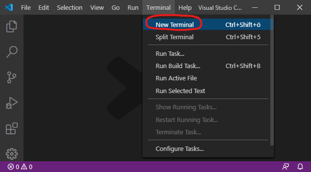
  <figcaption>Fig. 1: Commencez avec un éditeur vide et ouvrez une nouvelle session de terminal.</figcaption>
</figure>

2. Tapez dans la fenêtre du terminal la commande `mkdir` (`make directory`) and ...   
    specify with it the path to our new project folder `first`.

```
> mkdir <new folder path>
```

> **Important**!
> Pour des raisons de simplicité, le répertoire racine ``/`` est pris ici comme emplacement du dossier du projet. Ceci doit être évité en général et est même limité sous Unix / OSX. Prenez votre répertoire `/ home` à la place (`> cd ~ `). 

<figure>
  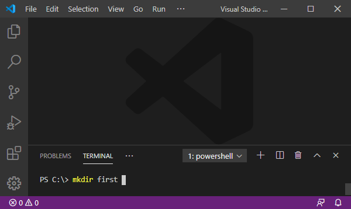
  <figcaption>Fig. 2: Créer un dossier de projet.</figcaption>
</figure>

3. Nous navigons vers notre dossier nouvellement crée via `cd` (`change directory`). 
```
> cd <new folder path>
```
<figure>
  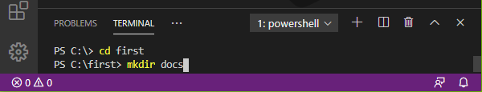
  <figcaption>Fig. 3: Accédez au dossier du projet.</figcaption>
</figure>

Nous voulons créer le premier fichier dans notre répertoire presque vide `first`.

4. Sélectionnez dans le menu `Fichier > Nouveau fichier` (<kbd> Ctrl </kbd> + <kbd> N </kbd>).
5. Copiez et collez le texte suivant dans sa fenêtre (<kbd> Ctrl </kbd> + <kbd> C </kbd>, <kbd> Ctrl </kbd> + <kbd> V </kbd>).

```json
{
  "name": "first",
  "description": "My first web page using microjam",
  "version": "0.1.0",
  "author": "it's me",
  "microjam": {}
}
```

6. Enregistrez le fichier via `File > Save As ...` (<kbd> Ctrl </kbd> + <kbd> Shift </kbd> + <kbd> S </kbd>) en lui donnant le nom de package. json`. Enregistrez-le dans le nouveau répertoire du projet `first`.

<figure>
  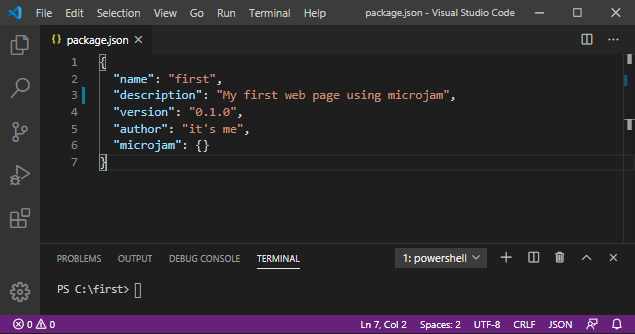
  <figcaption>Fig. 4: Créez le fichier 'package.json'.</figcaption>
</figure>


Avec cela, nous avons terminé notre première étape de création d'un nouveau projet et continuerons à générer du contenu.

## 2. Génération de contenu

Nous commençons maintenant à écrire des documents Markdown en utilisant `vscode` comme éditeur de markdown.

> **Informations**
> **μjam** différencie essentiellement trois types de documents:
>
> * `page` représente une page Web autonome comme une page` about`.
> * Les `articles` sont des pages Web construisant une liste consécutive d'entrées comme *les articles de blog*.
> * `index` représente la page principale, contenant potentiellement une table des matières de toutes les pages` article`.
>
> Une certaine disposition est attribuée à chacun de ces trois types.

En ce moment, nous avons une petite structure de répertoires:

```
/first
|_ package.json
|_ /docs   (empty folder)
```

### 2.1 `page` Documents

Créons une page à propos de notre premier site Web.

1. Copiez et collez le texte suivant dans une nouvelle fenêtre de démarque (<kbd>Ctrl</kbd> + <kbd>C</kbd>, <kbd>Ctrl</kbd> + <kbd>V</kbd>)

```
---
"layout": "page",
"title": "About"
---
````

**À propos de ce site**
  
Ce site a été créé comme une simple collection de fichiers markdown utilisant un *Static Site Generator* **&mu;jam** minimaliste.

2. Enregistrez-le dans le fichier `about.md` dans le nouveau répertoire` docs` (<kbd> Ctrl </kbd> + <kbd> Maj </kbd> + <kbd> S </kbd>).

3. Affichez la fenêtre d'aperçu en appuyant sur le bouton d'aperçu * entouré de rouge * (<kbd> Ctrl </kbd> + <kbd> K </kbd> <kbd> V </kbd>).

<figure>
  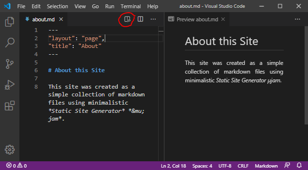
  <figcaption>Fig. 5: Rédaction du document de la page «à propos».</figcaption>
</figure>

> **Explication**
> Lorsque vous travaillez sur un fichier markdown, vous pouvez toujours examiner le résultat html côte à côte dans une fenêtre d'aperçu (Fig. 5). Veuillez noter quelques * métadonnées préliminaires * en haut de notre fichier `about.md`. Ces métadonnées sont placées entre deux lignes de trois tirets «---» et ainsi séparées du texte de démarque suivant. Ce style de séparation est tiré de `yaml`, mais les métadonnées elles-mêmes doivent suivre strictement la syntaxe` json`.

Nous voulons maintenant ouvrir notre dossier de projet complet dans `vscode`.

> **Explication**
> Après avoir enregistré avec succès `about.md` dans le dossier` docs` & ndash; qui est notre * premier * fichier de contenu dans ce projet & ndash; nous aurions peut-être réalisé que la structure des répertoires du projet a considérablement changé & ndash; magiquement. Nous voulons le prouver par la confortable vue Explorer de `vscode`.

4. Activez la vue Explorateur en appuyant sur le symbole le plus haut de la [*Barre d'activité*](https://code.visualstudio.com/docs/getstarted/userinterface#_basic-layout), situé à l'extrême gauche de l'éditeur.

5. La vue de l'explorateur s'ouvre et nous demande `'Ouvrir le dossier '`. En appuyant sur ce bouton et en sélectionnant notre répertoire `/ first`, nous obtenons une belle vue de notre structure de dossiers (Fig. 6). En même temps, la couleur de la barre d'état est passée de *violet* à *bleu*.

<figure>
  <div>&nbsp;&nbsp;</div>
  <figcaption>Fig. 6: Structure de dossier de projet étendue après l'enregistrement du premier fichier markdown.</figcaption>
</figure>

> **Explication**
> * Dans notre dossier `docs`, deux fichiers supplémentaires sont apparus:
> * tous les fichiers `html` générés, qui ont obtenu le nom de fichier de leurs fichiers` md` correspondants. Nous avons donc ici «about.html» uniquement.
> * `pages.json` contenant une liste de métadonnées étendues extraites de tous les fichiers markdown. À ce moment-là, il contient maintenant un tableau littéral comprenant les métadonnées d'un seul fichier `page`.
> * Un nouveau dossier `theme` a été créé à l'intérieur de` docs`. Il contient
> * `template.json`, qui contient les modèles par défaut pour générer des fichiers` html` à partir de fichiers `md`.
> * un seul fichier de feuille de style `styles.css` utilisé par les fichiers` html`.

Si vous souhaitez étendre cette structure de répertoires, ajoutez des fichiers ou modifiez vos modèles & ndash; peut-être voulez-vous ajouter des scripts & ndash; vous pouvez le faire manuellement à tout moment à partir de maintenant. `μjam` ne touchera plus la structure de vos dossiers et vos modèles. C'était une action initiale unique seulement.

Vous pouvez maintenant afficher votre première page Web dans le navigateur de votre choix.

6. * Glissez 'n drop * `about.html` de la vue Explorateur de l'éditeur (Fig. 6) dans la barre d'adresse du navigateur ... et voilà.

<figure>
  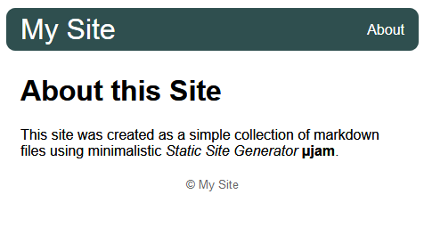
  <figcaption>Fig. 7: À propos de la page &ndash; vu dans le navigateur.</figcaption>
</figure>


### 2.2 Documents `article`

Nous voulons maintenir une série de documents «article», éventuellement sous forme de messages à utiliser avec un blog.

> **Informations**
> Les documents `article` ne sont pas tellement différents des documents` page`. Dans les * métadonnées préliminaires *, nous devons avoir un membre `date`. L'ajout d'un membre `description` est recommandé.

Le workflow s'illustre désormais par la création de deux articles:

1. Ouvrez un nouveau fichier via `Fichier> Nouveau fichier` (<kbd> Ctrl </kbd> + <kbd> N </kbd>).
2. Copiez et collez le texte suivant dans cette fenêtre (<kbd> Ctrl </kbd> + <kbd> C </kbd>, <kbd> Ctrl </kbd> + <kbd> V </kbd>)
3. Enregistrez-le dans le fichier `one.md` dans le répertoire` docs` (<kbd> Ctrl </kbd> + <kbd> Maj </kbd> + <kbd> S </kbd>).

`one.md`

```
---
"layout": "article",
"title": "Article One",
"description": "This is the first article",
"date": "2020-03-22"
---
````

*Abstrait*
Ceci est le premier article. Nous testons principalement la «coloration syntaxique» ici.
```
 *1. Mise en évidence de la syntaxe*
 *1.1 Html*

```html
<!doctype html>
<html>
    <head>
        <title>About</title>
    </head>
    <body>
    <header>header</header>
    <main>
       content here
    </main>
    <footer>footer</footer>
    </body>
</html>
````

4. Ouvrez un nouveau fichier via `Fichier> Nouveau fichier` (<kbd> Ctrl </kbd> + <kbd> N </kbd>).
5. Copiez et collez le texte suivant dans cette fenêtre (<kbd> Ctrl </kbd> + <kbd> C </kbd>, <kbd> Ctrl </kbd> + <kbd> V </kbd>)
6. Enregistrez-le dans le fichier `two.md` dans le répertoire` docs` (<kbd> Ctrl </kbd> + <kbd> Maj </kbd> + <kbd> S </kbd>).

`two.md`

```
---
"layout": "article",
"title": "Article Two",
"description": "This is the second article",
"date": "2020-03-23"
---
```

*Abstrait*

Ceci est le deuxième article. Ici, nous testons des formules mathématiques et des `svg` intégrés.

*1. Test*

*1.1 Formules mathématiques*

[Identité d'Euler](https://en.wikipedia.org/wiki/Euler%27s_identity) est considérée comme l'une des plus belles formules, car elle rassemble les nombres les plus fondamentaux en mathématiques dans une équation compacte (1).

$$e^{i\pi} + 1 = 0$$ (1)

*1.2 Vector Graphics*

<figure>
<svg width="200" height="100">
   <path d="M100,10L123.5,82.4L61,37.6L138,37.6L76.5,82.4Z" stroke="darkslategray" stroke-width="4" fill="orange"/>
</svg>
  <figcaption>Fig. 1: SVG Star</figcaption>
</figure>

<figure>
  
  <figcaption>Fig. 8: Document article 'two.md'.</figcaption>
</figure>

> **Explication**
> Tout en ayant sauvegardé ces deux documents `* .md` pour la première fois, leurs documents` * .html` correspondants ont été créés et leurs * métadonnées de base * ont également été extraites, légèrement étendues et ajoutées à la liste des métadonnées des pages dans `pages.json`. Veuillez noter que `μjam` mettra à jour les métadonnées pendant le stockage de fichiers consécutifs et les supprimera même avec les fichiers` * .html`, lorsque vous supprimez manuellement un fichier de démarquage du système de fichiers.
>
> Vous avez peut-être aussi remarqué que nous avons mélangé le balisage LaTeX math et SVG dans notre texte markdown du fichier `two.md` (Fig. 8).

### 2.3 `index` Document

Créons maintenant la page d'accueil de notre site Web.

> **Informations**
> Tout document markdown marqué comme «" index "» dans son entrée *mise en page avant* se verra ajouter une liste de tous les «articles» immédiatement après sa section «content» normale.

1. Ouvrez un nouveau fichier via `Fichier> Nouveau fichier` (<kbd> Ctrl </kbd> + <kbd> N </kbd>).
2. Copiez et collez le texte suivant dans cette fenêtre (<kbd> Ctrl </kbd> + <kbd> C </kbd>, <kbd> Ctrl </kbd> + <kbd> V </kbd>)
3. Enregistrez-le dans le fichier `index.md` du répertoire` src` (<kbd> Ctrl </kbd> + <kbd> Shift </kbd> + <kbd> S </kbd>).

```
---
"layout": "index",
"title": "My Site",
"date": "2020-03-24",
"description": "Homepage of microjam demo site",
"tags": ["microjam","Jamstack","static page","personal",   
         "student","academics","math","vector graphics"],
"category": ["web","math","graphics"]
---
````
Ceci est un site de démonstration contenant quelques articles. Il a été réalisé par **μjam**, un générateur de site statique minimaliste.

<figure>
  
  <figcaption>Fig. 9: Page index .</figcaption>
</figure>

> **Explication**
> Puisque les deux documents `article` ont des sections` abstract`, ce contenu est utilisé pour la brève description des articles. Dans le cas d'une section `abstract` manquante, l'entrée` description` de * frontmatter metadata * aurait été prise à la place.

Le processus de génération de contenu du site de démonstration est maintenant terminé.

## 3. Publiez dans le monde

Nous voulons bien utiliser ici [GitHub](https://www.edureka.co/blog/how-to-use-github/).
Et nous voulons que cette *plateforme d'hébergement de contrôle de version* soit connectée à notre référentiel de projet local via `vscode`.

> **Informations**
> *GitHub* en tant que plate-forme très utilisée est un service de partage de code. Mais contrairement aux simples fournisseurs de stockage en nuage, GitHub prend principalement en charge le travail de projet, où les fichiers sont régulièrement modifiés, téléchargés et doivent être gérés via le contrôle de version. C'est exactement ce que nous voulons avoir avec notre projet de site Web et le meilleur de tous: GitHub nous fournit un référentiel en ligne gratuitement. Nous avons alors simplement un espace de stockage, appelé *repository*, où notre projet réside sur le web. Ce n'est pas un serveur Web classique. Dans le sens de *Jam*, c'est un CDN &ndash; *réseau de diffusion de contenu*.

### 3.1 Création d'un dépot local git

[Git](https://git-scm.com/) est un puissant outil de contrôle de version, qui nous permet de créer et de gérer un *dépôt local*.

> **Information**
> Avec elle, nous avons alors un **outil de contrôle des versions** *Git* collaborant avec la **plateforme d'hébergement de contrôle des versions** *GitHub*. 
Et Visual Studio Code est livré avec une *intégration de contrôle de source* et dispose surtout d'un excellent [support Git] (https://code.visualstudio.com/docs/editor/versioncontrol#_git-support). 

> **Important** !
> Il y a de fortes chances que Git soit déjà installé sur votre machine locale. Saisissez `'> git --version'` sur la ligne de commande de votre terminal. Vous verrez la version actuelle installée.
Sinon, si on vous dit que "git" est inconnu, vous devez l'installer. Ne vous inquiétez pas, cela peut être fait facilement en visitant ce [site de téléchargement] (https://git-scm.com/downloads). J'attendrai ici.

Traduit avec www.DeepL.com/Translator (version gratuite)

1. Naviguer vers le troisième symbole de la barre verticale de gauche [*Activity Bar*] (https://code.visualstudio.com/docs/getstarted/userinterface#_basic-layout) ... appuyez dessus.
2. Appuyez sur le bouton bleu nommé "Initialize Repository".
3. Tapez le message de commit "Initial commit".
4. <kbd>Ctrl</kbd> + <kbd>Enter</kbd> ou ...
    * Déplacez la souris sur " CHANGES " en disant " Stage All Changes ".
    * Appuyez sur le signe " + ".
    * Appuyez sur le *coche*.

<figure>
  <span>&nbsp;&nbsp;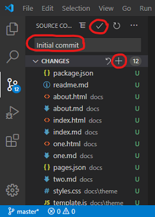&nbsp;&nbsp;</span>
  <figcaption>Fig. 10: Initialiser le dépôt git local</figcaption>
</figure>

> **Explication**
> En initialisant notre dépôt local, nous avons ajouté un répertoire caché nommé "git" à notre dossier de projet. Heureusement, nous n'avons pas à nous en soucier du tout. 
> * Dans la vue de contrôle des sources avec l'étape 3, nous voyons nos 12 fichiers étiquetés "U", qui signifie *untracked file*. 
> * Après "Stage All Changes" à l'étape 4, tous les fichiers ont été étiquetés "A", ce qui signifie *ajouté* au dépôt.
> * Après l'étape 5, tous les fichiers ont disparu de la vue de git, ce qui signifie que git a pris le contrôle complet de leur version à partir de maintenant. Aucune modification des fichiers n'est visible.
> 
> Pour en savoir plus, je vous recommande de lire [1](#1) [4] et [5].

Traduit avec www.DeepL.com/Translator (version gratuite)

L'utilité de git pour nous est évidente, lorsque nous modifions le contenu de ... dites "one.md" et enregistrez le fichier (<kbd>Ctrl</kbd> + <kbd>S</kbd>).

<figure>
  
  <figcaption>Fig. 11: Index page.</figcaption>
</figure>

> **Explication**
> La vue de git montre quatre fichiers étiquetés "M", ce qui signifie *modifié*. 
> 1. Nous avons modifié `one.md` manuellement. 
> 2. Lors de la sauvegarde, `one.html` a été nouvellement créé/écrit.
> 3. le fichier `pages.json` a été modifié automatiquement.
> 4. Puisque `one.md` est un fichier `article`, la liste d'articles de `index.html` est potentiellement affectée et le fichier `index.html` a été mis à jour.
>
> Les étapes 1 à 3 sont toujours effectuées sous le capot par **μjam** sur le stockage des fichiers markdown.

Nous pouvons à nouveau valider directement ces modifications maintenant ou le faire plus tard, tout en continuant à travailler sur d'autres fichiers sources markdown.

### 3.2 Dépôt (Repository) en ligne

Vous voulez voir vos pages en ligne maintenant ? Vous avez donc besoin d'un compte GitHub *utilisateur personnel* pour pouvoir continuer.

> **Important!**
> Si vous n'avez pas de compte GitHub personnel, vous devez [créer un nouveau compte GitHub gratuit ici] (https://help.github.com/en/github/getting-started-with-github/signing-up-for-a-new-github-account) .
> Veuillez également noter qu'il vous est demandé de fournir une adresse électronique valide pendant la procédure de vérification.

Maintenant que vous êtes le propriétaire `<nom d'utilisateur>` d'un compte GitHub ...
1. Naviguez sur votre navigateur personnel à l'adresse suivante : https://github.com/<nom d'utilisateur>`.
2. Dans le coin supérieur droit de cette page GitHub, utilisez le menu déroulant "+", et sélectionnez "Nouveau dépôt".

<figure>
  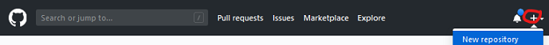
  <figcaption>Fig. 12: Homepage of your GitHub account.</figcaption>
</figure>

3. Remplissez le formulaire ...
    * Prenez un nom court et mémorable comme " premier ".
    * Description : "Premier site web alimenté par microjam" ou un texte similaire.
    * Choisissez *public* ou *privé*.
    * Laissez le reste tel quel.
    * Appuyez sur le bouton *Create repositiory*.

<figure>
  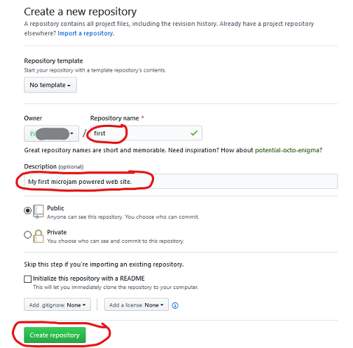
  <figcaption>Fig. 13: Formular: Creer un nouveau dépot.</figcaption>
</figure>

3. Dans un nouvel onglet/fenêtre du navigateur, naviguez jusqu'à `https://api.github.com/users/<nom d'utilisateur>` .
4. Copiez votre `<github user id>` à partir de la deuxième ligne (une série de 6 chiffres décimaux ou plus) (<kbd>Ctrl</kbd> + <kbd>C</kbd>) [3].
5. Dans la fenêtre du terminal (sur la ligne de commande), tapez :  

```
> git config --global user.name <github user id>
> git remote add origin https://github.com/<username>/<repository name>.git
> git push -u origin master
```

> **Explication**
> Veuillez noter que l'utilisation de ces commandes de terminal est nécessaire pour le premier transfert de fichiers vers GitHub uniquement. Ainsi, après avoir fait cela une fois, vous pouvez l'oublier pour toujours.

Le résultat de cette action sur votre page de compte GitHub sera quelque chose comme ceci ... (rafraîchissez la page !)

<figure>
  
  <figcaption>Fig. 14: Successfully pushed our repository to GitHub.</figcaption>
</figure>

Nous nous occuperons de la *README* dans une minute. Nous sommes impatients de voir notre site web en ligne.

6. Sélectionnez "Paramètres" sur la page de votre compte GitHub.
7. Faites défiler vers le bas jusqu'à "GitHub Pages".
8. Dans "Select source", cochez la case "master branch / docs folder". 
9. Naviguez jusqu'à l'url indiquée à ``Votre site est publié à``. 

<figure>
  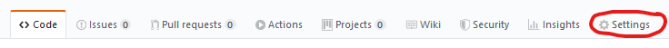
  <br>
  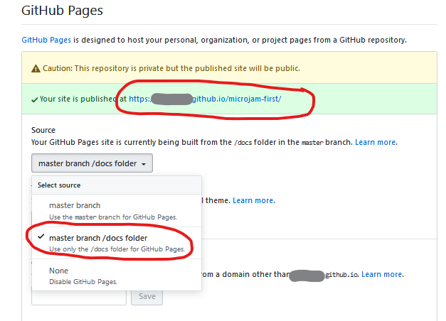
  <figcaption>Fig. 15: Activate GitHub Pages.</figcaption>
</figure>

**Congrats, your first website is online now !**

### 3.3 Le flux de travail final

J'aimerais vous montrer à quoi ressemble le travail sur votre site web à partir de maintenant. Nous allons revenir à notre éditeur de "vscode" et ...

1. Ajouter un fichier `readme.md` (contenu ci-dessous) comme demandé et sauvegarder (<kbd>Ctrl</kbd> + <kbd>Shift</kbd> + <kbd>S</kbd>).

* Un dépôt d'échantillons minimal pour *&mu;jam**

2. Modifiez à nouveau le contenu de `one.md` et sauvegardez (<kbd>Ctrl</kbd> + <kbd>S</kbd>).
3. Saisissez un *message de confirmation* "Add readme"` (<kbd>Ctrl</kbd> + <kbd>Enter</kbd>).
4. Dans une éventuelle fenêtre de message `vscode` à venir, `Voudriez-vous automatiquement ...` sélectionner `Toujours` .
5. Dans la barre d'état, sélectionnez soit le petit "nuage", soit le symbole "flèche vers le haut" pour télécharger les fichiers modifiés sur GitHub.

<figure>
  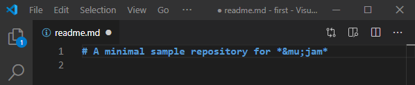
  <br>
  
  <br>
  
  <br>
  
  <figcaption>Fig. 16: Workflow: Adding 'readme.md' and modifying 'one.md'.</figcaption>
</figure>

C'est tout. Veuillez vérifier l'arrivée du fichier readme à Github et la bonne mise à jour de votre site web.

Etapes `2-3-5` ci-dessus c'est-à-dire 

* modifier le contenu 
* type de message d'engagement
* téléchargement vers GitHub

est tout ce que vous devez faire à partir de maintenant. 

Bonne question &ndash ; merci &ndash ; ce guide d'installation a en fait été rédigé par **&mu;jam** &ndash ; au cours d'un processus appelé [*dogfooding*](https://en.wikipedia.org/wiki/Eating_your_own_dog_food) ` :)`.

*Happy publishing ...*   
`--`   
Stefan G.

## References 

[1] [jamstack.wtf](https://jamstack.wtf/)   
[2] [Not Your Dad's IT](http://www.notyourdadsit.com/blog/2018/4/3/cheatsheet-setup-github-on-visual-studio-code)    
[3] [Where can I find the GitHub ID in my account?](https://stackoverflow.com/questions/17308954/where-can-i-find-the-github-id-in-my-account/40695228)    
[^4]: [Version Control Basics with Github and VS Code](https://medium.com/@brygrill/version-control-basics-with-github-and-vs-code-1c1906cadd33)  
[5] [Version Controlling with Git in Visual Studio Code and GitHub](https://azuredevopslabs.com/labs/azuredevops/github/)  
[6] [Versionskontrolle mit Git auf einem Hoster wie GitHub, GitLab, BitBucket unter Visual Studio Code einrichten](https://machine-learning-blog.de/2019/10/03/versionskontrolle-mit-git-auf-einem-hoster-wie-github-gitlab-bitbucket-unter-visual-studio-code-einrichten/)   
[7] [Git Integration in Visual Studio Code](https://www.digitalocean.com/community/tutorials/git-integration-in-visual-studio-code)

