# Usage

## Pré-requis

On suppose que vous
* avez des connaissances de base, comment utiliser [*Visual Studio Code*](https://code.visualstudio.com/).
* avez [installé](./installationGuide.html) avec succès **&mu;Jam** extension to VSCode.

## Activation

&mu;Jam est une extension de VSCode et VSCode l'activera sous certaines conditions. As & mu; Jam traite principalement & ndash; ou plus précis exclusivement & ndash; avec les fichiers markdown, il sera activé, lorsque vous

* ouvrez votre premier fichier de démarque, ou ...
* démarrez VSCode avec un fichier markdown comme document actif

<figure>
  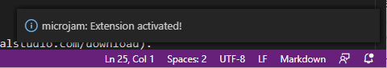
  <figcaption>Fig. 1: message d'activation &mu;Jam .</figcaption>
</figure>

Vous verrez un message d'activation dans le coin inférieur droit de la fenêtre VSCode.
Votre dossier de référentiel n'est pas nécessairement ouvert dans VSCode. & mu; Jam fonctionnera également en mode fichier unique.

Mais ... avoir activé correctement & mu; Jam ne signifie pas que cela fonctionne avec tous les fichiers de démarque. Il accepte les fichiers

* étant dans un répertoire `docs` ou l'un de ses sous-répertoires ` docs / **` et ...
* appartenant à un dépôt ayant une entrée `" microjam ": {...}` dans son `package.json`

seulement.

## Générer des pages Web

&mu;Jam peut faire exactement *deux choses* pour toi:

* générer / mettre à jour un fichier `html` à partir d'un seul fichier` md` ...
* générer / mettre à jour les fichiers `html` à partir de ** tous les ** fichiers` md` dans un référentiel

### Fichiers uniques Markdown

Chaque fois que vous travaillez sur un fichier Markdown et enregistrez-le via

* menu `File > Save As` or (<kbd>Ctrl</kbd> + <kbd>Shift</kbd> + <kbd>S</kbd>) or ...
* menu `File > Save` or (<kbd>Ctrl</kbd> + <kbd>S</kbd>)

son fichier `html` correspondant sera généré automatiquement par &mu;Jam, qui mettra également à jour le fichier `pages.json` et éventuellement certains fichiers *index*, si vous aviez modifié un `"layout": "article"` document.

<figure>
  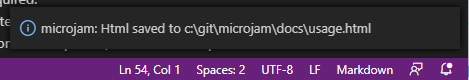
  <figcaption>Fig. 2: &mu;Jam Html sauvegarde les messages.</figcaption>
</figure>

> ** Remarque: **
> Cette commande `Fichier> Enregistrer` ** uniquement ** enregistre son fichier Markdown, s'il a été modifié depuis sa dernière commande de stockage. Ce n'est que dans ce cas que le fichier `html` correspondant est mis à jour.

Afin de vous aider à * forcer la mise à jour d'un seul fichier *, & mu; Jam nous fournit la commande <kbd> Ctrl </kbd> & nbsp; + & nbsp; <kbd> K </kbd> & nbsp; &nbsp; <kbd> H </kbd> (pensez à **H**tml). Ceci est également disponible via différents menus (voir ci-dessous).

### Tout fichier Markdown

Il peut s'avérer nécessaire de reconstruire tous les fichiers `html`. Un scénario est que nous venons de modifier nos modèles dans `template.js`.

Pour archiver ceci, nous pouvons utiliser la commande &mu;Jam <kbd>Ctrl</kbd>&nbsp;+&nbsp;<kbd>K</kbd>&nbsp;&nbsp;<kbd>A</kbd> (pensez à **T**out).

<figure>
  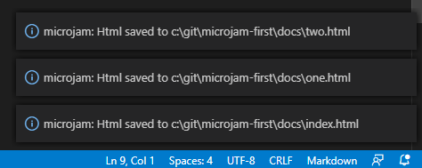
  <figcaption>Fig. 3: Commande &mu;Jam - forcer la reconstruction de tous les fichiers Html</figcaption>
</figure>

Veuillez noter que seuls les trois derniers fichiers reconstruits sont visibles une fois terminés en tant que messages &mu;Jam.

### Menus

<figure>
  <div>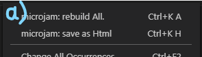
  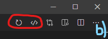</div><br>
  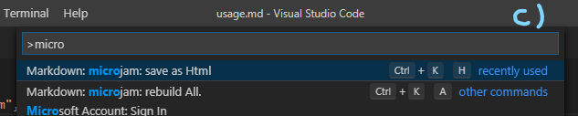<br>
  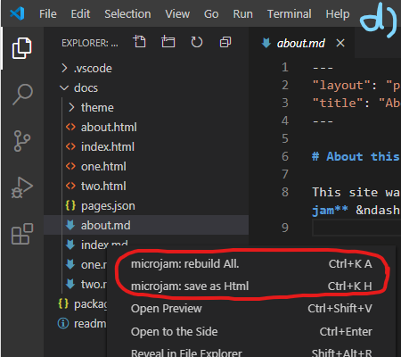
  <figcaption>Fig. 4: commandes &mu;Jam - accessible via différents menus</figcaption>
</figure>

Duex commandes &mu;Jam sont accessibles via

1. Menu contextuel de l'éditeur (clic droit) (a)
2. Menu titre de l'éditeur (b)
3. Palette de commandes globale VSCode (c)
4. Menu contextuel de l'explorateur (d)

> **Remarque:**
> Les menus dans VSCode sont définis statiquement avec des extensions comme &mu;Jam. Ainsi, les menus ci-dessus sont toujours affichés lors de l'édition de tout document markdown. Mais avec des documents markdown **n'appartenant pas** à un référentiel valide, l'invocation de ces commandes de menu n'aura **silencieusement** aucun effet.

### Supprimer manuellement des fichiers

Vous ne voudrez généralement pas supprimer les fichiers générés automatiquement, car ils sont régulièrement mis à jour par & mu; Jam. Mais si vous souhaitez explicitement le faire, vous pouvez utiliser la vue Explorateur (Fig. 5).

<figure>
  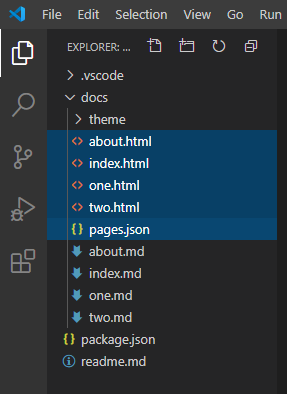
  <figcaption>Fig. 5: 
Vue Explorateur - supprimez manuellement ces fichiers uniquement</figcaption>
</figure>

* Il est sûr de supprimer tous les fichiers `*.html` ainsi que `pages.json` (<kbd> Supprimer </kbd> ou <kbd> Shift </kbd> + <kbd> Supprimer </kbd>).
* Si vous supprimez manuellement un fichier markdown, son fichier `html` correspondant sera systématiquement supprimé par &mu;Jam lors de la prochaine exécution de la commande. `pages.json` sera également mis à jour en conséquence.
* Vous pouvez supprimer le dossier `docs/theme` et même le répertoire `.vscode` .&mu;Jam les générera à nouveau en utilisant le contenu par défaut. Mais sachez que les personnalisations ou copies possibles se perdent alors. Vous ne voulez généralement pas faire ça.
* Vous ne devez supprimer aucun autre fichier de votre référentiel, sauf que vous savez ce que vous faites.

> ** Remarque: **
> L'ordre de tri des fichiers par *type* a du sens dans la vue de l'explorateur, mais ce n'est pas l'ordre par défaut de VSCode. Ainsi &mu;Jam ajoute une entrée `""explorer.sortOrder":"type"` au fichier de paramètres utilisateur `.vscode/settings.json`. Vous pouvez ajouter plus de paramètres individuels à ce fichier.

## Editer und fichier Markdown

Il n'y a pas grand-chose à dire ici, car l'édition markdown est parfaitement effectuée par l'éditeur VSCode. Seules quelques fonctionnalités d'assistance de & mu; Jam méritent d'être mentionnées.

### Extrait de frontmatter

Lors du démarrage d'un nouveau fichier markdown, &mu;Jam vous assiste en insérant un modèle *frontmatter* partiellement rempli à l'emplacement actuel de l'éditeur.

<figure>
  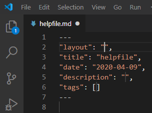
  <figcaption>Fig. 6: Création automatique d'un sceleton d'extrait de frontmatter</figcaption>
</figure>

Simple type <kbd>Ctrl</kbd>+<kbd>k</kbd> <kbd>-</kbd> pour avoir ça.

### Extrait de table de contenu

When finishing a markdown document containing several headings possibly in multiple levels, we would welcome an automatic generation of a table of contents (toc). This is inserted at current editor location by &mu;Jam at our fingertips.

<figure>
  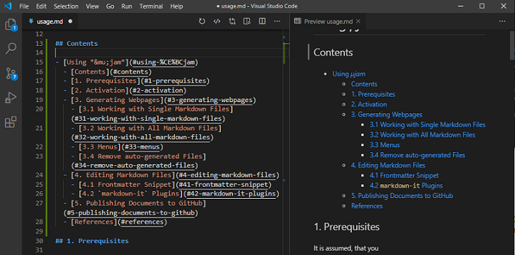
  <figcaption>Fig. 7: Auto-create table of content</figcaption>
</figure>

Simply type <kbd>Ctrl</kbd>+<kbd>k</kbd> <kbd>t</kbd> (think &nbsp;**t**oc) for getting this.

> ** Remarque: **
> La table des matières insérée est statique et non configurable, c'est-à-dire minimaliste:
> * Si vous ne voulez pas avoir d'en-tête dans le toc (peut-être «Contenu»), supprimez-le simplement de la liste générée dans le document markdown.
> * La génération de certains niveaux toc uniquement n'est pas prise en charge. Supprimez simplement les entrées indésirables manuellement.
> * Si vous modifiez le texte d'un titre, la toc ne se mettra pas à jour automatiquement. Recréez la toc puis manuellement.
> * Les entêtes des sections de code markdown sont également insérés de manière incorrecte. Vous devez les supprimer manuellement.

### Extrait de liste de navigation

Parfois, nous ne voulons pas avoir de table des matières interne, mais une liste de navigation externe. Avec cela, nous pourrions composer une barre latérale de navigation. Dans ce cas, nous voulons avoir des URL locales explicites `html`, comme dans ...

```md
- [Installation](installationGuide.html#installation)
  - [un nouveau projet](installationGuide.html#a-new-project)
  - [Generation du Contenu](installationGuide.html#generating-content)
  - [Publier au monde](installationGuide.html#publish-to-the-world)
```

Pour obtenir cela, nous tapons <kbd>Ctrl</kbd>+<kbd>k</kbd> <kbd>n</kbd> (think &nbsp;**n**av).

### Permaliens

Cette fonctionnalité est copiée sans vergogne depuis GitHub. Dans le navigateur ... chaque fois que vous survolez avec votre pointeur un en-tête, un petit symbole apparaît. En survolant ensuite ce symbole, l'URI local du document de l'en-tête en question peut être copié (clic droit) et affiché dans la barre d'état en même temps.

<figure>
  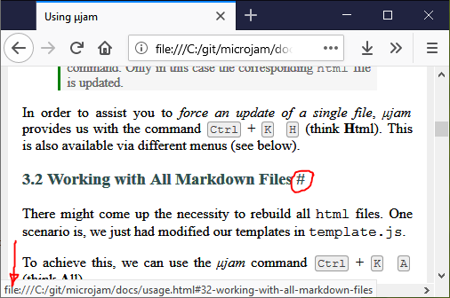
  <figcaption>Fig. 8: Vue Explorateur - supprimez manuellement ces fichiers uniquement</figcaption>
</figure>

Avec cette fonctionnalité activée, vos visiteurs peuvent copier et coller cet emplacement et ainsi créer un lien dans vos pages à l'aide de ces *permaliens*.

Pour activer cette fonctionnalité, vous devez ajouter

```markdown
---
"permaliens": "#"
---
```
à la section frontmatter de votre page. Vous êtes autorisé à prendre un symbole de caractère de votre choix. `"permalink": true` est également possible, avec '#' comme symbole par défaut.

### `markdown-it` Plugins

VSCode utilise [markdown-it](https://github.com/markdown-it/markdown-it) comme son analyseur de démarques en interne, tout comme & mu; Jam. Il existe de nombreux plugins markdown-it disponibles.
&mu;Jam ne prend en charge que deux d'entre eux actuellement:

* Plugin mathématique `markdown-it-texmath`
* Plugin de notes de bas de page `markdown-it-footnotes`

Comme ils sont tous les deux inactifs au départ, nous pouvons les activer & ndash; si nous voulons & ndash; en ajoutant ce qui suit à `.vscode/settings.json` ...

```json
"microjam.markdownItPlugins": {
  "markdown-it-texmath": {
    "engine": "katex",
          "delimiters": "dollars",
          "macros": {"\\RR": "\\mathbb{R}"}
  },
  "markdown-it-footnote": {}
}
```
Il est possible d'étendre &mu;Jam en utilisant d'autres plugins markdown-it, mais cela sort du cadre de ce manuel de l'utilisateur. 

## Publier sur GitHub

Nous supposons ici que vous avez déjà un référentiel GitHub local et distant valide. Lire [guide installation](./installationGuide.html) autrement.

<figure>
  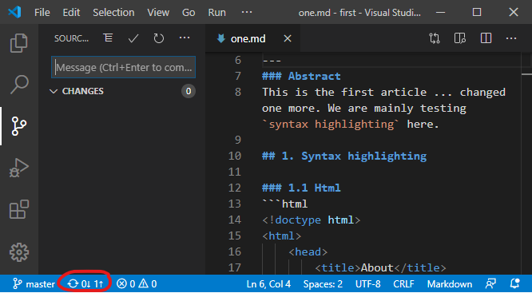
  <figcaption>Fig. 16: Workflow: ajout de 'readme.md' et modification 'one.md'.</figcaption>
</figure>

Pour publier vos fichiers générés ou modifiés sur GitHub, vous pouvez utiliser la vue * Contrôle de source *.

* Tapez une chaîne de message de validation.
* Envoyez-le par <kbd> Ctrl </kbd> + <kbd> Entrée </kbd>.
* Appuyez sur le symbole * flèche vers le haut * dans la barre d'état.


## Le flux de travail habituel

Je voudrais vous montrer à quoi ressemble le travail sur votre site Web, une fois que vous avez tout installé et que vous avez déjà écrit vos fichiers de démarque.

1. Vous ouvrirez à nouveau votre répertoire de projet `first`, qui a déjà la structure suivante

```
/first
|_ package.json
|_ /docs
   |_ /theme
   |_ index.html
   |_ one.html
   |_ two.html
   |_ pages.json
   |_ index.md
   |_ one.md
   |_ two.md
```

2. Ajoutez un fichier `readme.md` (contenu ci-dessous) et enregistrez-le (<kbd> Ctrl </kbd> + <kbd> Shift </kbd> + <kbd> S </kbd>) dans le dossier racine de votre projet. Son contenu pourrait être un peu commeun référentiel d'échantillons minimal pour &mu;Jam.

3. Modifiez le contenu de «one.md» et enregistrez (<kbd> Ctrl </kbd> + <kbd> S </kbd>).
4. Tapez un * message de validation * `` Ajouter un fichier readme '' (<kbd> Ctrl </kbd> + <kbd> Entrée </kbd>).
5. Dans une fenêtre de message `vscode` éventuellement à venir` Souhaitez-vous automatiquement ... `sélectionnez` Toujours`.
6. Dans la barre d'état VSCode, sélectionnez le petit symbole «cloud» ou «flèche vers le haut» pour télécharger les fichiers modifiés sur GitHub.

<figure>
  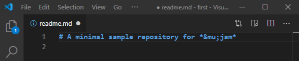
  <br>
  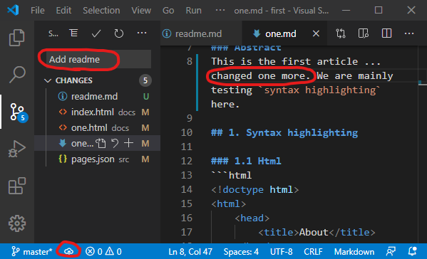
  <br>
  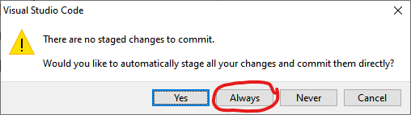
  <br>
  
  <figcaption>Fig. 16: Workflow: Ajout de 'readme.md' et modification de 'one.md'.</figcaption>
</figure>

C'est tout. Veuillez vérifier l'arrivée du fichier readme sur Github et la mise à jour réussie de votre site Web.

Les étapes «2-3-5» ci-dessus, c'est-à-dire

* modifier le contenu
* type message de validation
* télécharger sur GitHub

est tout ce que vous devez faire à partir de maintenant.

Juste pour mentionner & ndash; cette documentation a été rédigée par **&mu;Jam** au cours d'un processus appelé [*dogfooding*](https://en.wikipedia.org/wiki/Eating_your_own_dog_food) `:)`.

*Bonne publication ...*   

## Templates

* [microjam-simple](https://github.com/goessner/microjam-simple) &ndash; Un modèle de site Web simple pour μJam
* [microjam-tufte](https://github.com/goessner/microjam-tufte) &ndash; Un modèle de style Tufte pour μJam
* [microjam-docs](https://github.com/goessner/microjam-docs) &ndash; Un thème de documentation pour μjam avec barre latérale
* [microjam-g2](https://github.com/goessner/microjam-docs) &ndash; Un theme pour μjam + g2

## Entrées en première page

| Entry |  Type  | Comment |
|:------|:--------|:-----|:----|
| `auteur` | string | Nom(s) de l'auteur utilisé(s) par les moteurs de recherche. |
| `date` | string | Creation d'une date `yyyy-mm-dd` comme `2020-12-31`. |
| `description` | string | Description de la page utilisée par les moteurs de recherche. |
| `longueur` | string | utilisé par le navigateur pour la césure. La valeur par défaut est `"en"`. |
| `layout` | enum | μJam connaît les types de mise en page suivants:<br> `["page","article","index","none"]`<br>D'autres types de mise en page personnalisés sont pris en charge<br> et traitées comme des "mises en page" en interne. |
| `math` | boolean | Prise en charge des formules mathématiques LaTeX utilisant les délimiteurs "$". |
| `permalink` | string \| `true` |  Placez le symbole de caractère comme ancre de lien derrière les titres.<br>Le symbole de caractère par défaut est `"#"`. |
| `tags` | tableau de chaînes de caractères | utilisées comme mots-clés pour les moteurs de recherche.<br>Exemple `["web,"page","physics","svg"]` |
| `titre` | string | Titre de la page affiché dans la barre de titre du navigateur. |
| `uses` | array of objects | Injecter des ressources externes dans la page.<br>Exemple `"uses":[ { "uri": "navigation.md" } ]` |

## Commandes clavier 

| Command |  Mnemonic  | Menu | Action |
|:------|:--------|:-----|:----|
| <kbd>Ctrl</kbd>&nbsp;+&nbsp;<kbd>K</kbd>&nbsp;&nbsp;<kbd>H</kbd> | **H**tml | &ndash; | Générer un seul fichier Html |
| <kbd>Ctrl</kbd>&nbsp;+&nbsp;<kbd>K</kbd>&nbsp;&nbsp;<kbd>A</kbd> | **A**ll | &ndash; | Generer tous les fichiers Html |
| <kbd>Ctrl</kbd>&nbsp;+&nbsp;<kbd>K</kbd>&nbsp;&nbsp;<kbd>-</kbd> | --- | &ndash; | Insérer un modèle de frontmatter |
| <kbd>Ctrl</kbd>&nbsp;+&nbsp;<kbd>K</kbd>&nbsp;&nbsp;<kbd>T</kbd> | **T**oC | &ndash; | Insérer une table des matières |
| <kbd>Ctrl</kbd>&nbsp;+&nbsp;<kbd>K</kbd>&nbsp;&nbsp;<kbd>N</kbd> | **N**av | &ndash; | Copier le démarque de navigation dans le presse-papiers |
| |
| <kbd>Ctrl</kbd>&nbsp;+&nbsp;<kbd>K</kbd>&nbsp;&nbsp;<kbd>V</kbd> | pre**V**iew | &ndash; | Ouvrir un preview window |
| <kbd>Ctrl</kbd> + <kbd>Enter</kbd> | &ndash; |  &ndash; | Valider les modifications |
| <kbd>Ctrl</kbd> + <kbd>Shift</kbd> + <kbd>S</kbd> | **S**ave A**s** |`File > Save As` | Enregistrer le fichier sous ... |
| <kbd>Ctrl</kbd> + <kbd>S</kbd> | **S**ave |`File > Save` | Sauvegarder le fichier |
| <kbd>Ctrl</kbd> + <kbd>C</kbd> | **C**opy |`Edit > Copy` | Copier le texte dans le presse-papiers |
| <kbd>Ctrl</kbd> + <kbd>V</kbd> | Paste |`Edit > Paste` | Récupérer le texte du presse-papiers |

Les utilisateurs Apple appuieront sur la touche <kbd> Cmd </kbd> au lieu de la touche <kbd> Ctrl </kbd>.


## References 

[1] [jamstack.wtf](https://jamstack.wtf/)   
[2] [Not Your Dad's IT](http://www.notyourdadsit.com/blog/2018/4/3/cheatsheet-setup-github-on-visual-studio-code)    
[3] [Where can I find the GitHub ID in my account?](https://stackoverflow.com/questions/17308954/where-can-i-find-the-github-id-in-my-account/40695228)    
[4]: [Version Control Basics with Github and VS Code](https://medium.com/@brygrill/version-control-basics-with-github-and-vs-code-1c1906cadd33)  
[5] [Version Controlling with Git in Visual Studio Code and GitHub](https://azuredevopslabs.com/labs/azuredevops/github/)  
[6] [Versionskontrolle mit Git auf einem Hoster wie GitHub, GitLab, BitBucket unter Visual Studio Code einrichten](https://machine-learning-blog.de/2019/10/03/versionskontrolle-mit-git-auf-einem-hoster-wie-github-gitlab-bitbucket-unter-visual-studio-code-einrichten/)   
[7] [Git Integration in Visual Studio Code](https://www.digitalocean.com/community/tutorials/git-integration-in-visual-studio-code)   
[8] [CommonMark - Specification of Markdown](https://commonmark.org/)
[9] [Configuring a custom domain for your GitHub Pages site](https://help.github.com/en/github/working-with-github-pages/configuring-a-custom-domain-for-your-github-pages-site)

